  

## 📌 About Me
- 🔭 I’m currently working on **ChainSense**
- 🌱 I’m currently learning **Jetpack Compose**
- 👨‍💻 My CV is available at [https://rxresu.me/yarasarda/2026subat](https://rxresu.me/yarasarda/2026subat)
- 📫 How to reach me: **ozkateca@gmail.com**
- ⚡ Fun fact: **I am a maker and graffiti artist**

## 🧠 My Focus Areas
- 📱 Android Development
- 🤖 Wearable Technology
- 🥤 3D Printing

## 📊 GitHub Stats & Trophies

  
  

  

  

  

## 🛠️ Languages & Tools

### 📱 Mobile & Core

  
  
  
  

### 🔌 Embedded & Low Level

  
  
  

### 🎨 Game Dev & Design

  
  

### 🌐 Web & Backend

  
  
  
  

### 🔧 Tools

  
  

  

## 🔗 Connect with Me

   
   
  
   
  

<picture>
  <source media="(prefers-color-scheme: dark)" srcset="https://raw.githubusercontent.com/abozanona/abozanona/output/pacman-contribution-graph-dark.svg">
  <source media="(prefers-color-scheme: light)" srcset="https://raw.githubusercontent.com/abozanona/abozanona/output/pacman-contribution-graph.svg">
  
</picture>

  <a href="https://www.buymeacoffee.com/yarasarda" target="_blank">
    <img src="https://www.buymeacoffee.com/assets/img/custom_images/orange_img.png" alt="Buy Me A Coffee" style="height: 41px !important;width: 174px !important;box-shadow: 0px 3px 2px 0px rgba(190, 190, 190, 0.5) !important;-webkit-box-shadow: 0px 3px 2px 0px rgba
